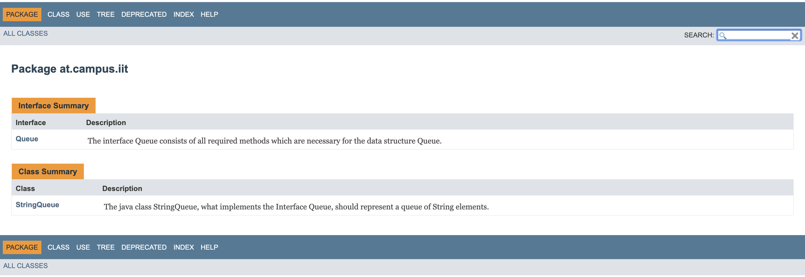

# Lab Report

Abgabe 04

Daniel Lamprecht

Mathias Gsell

Repository: https://github.com/lamprechtdaniel/19-Abgabe04-Lamprecht-Gsell

***
## Vorgehen
---
1. Zu Beginn wurde das Repository erstellt sowie das Queue-Beispiel eingebunden
2. Das File readme.md wurde erstellt und mit den Tasks mit Github-Flavor erweitert
3. Anschließend wurde der Labreport im Readme.md hinzugefügt (die Tasklist befindet sich nun am Ende des Readme.md File)
4. Das Queue-Beispiel wurde gedebuggt, es wurden die Fehler gefunden sowie ausgebessert. Ebenso wurde der Code optimiert. Die ausgebesserten Stellen wurden kommentiert. Folgende Fehler wurden gefunden:
    - 
    Hier wurde die Variabel maxsize im Konstruktor zu "maxSize" geändert. Ebenso wurde auf die Membervariable mit this. zugegriffen, um Missverständnisse zu vermeiden.
    - 
    Ebenso wurde hier ein Default-Konstruktor hinzugefügt, um die maxSize von 5 zu behalten.
    - 
    In de if-Anweisung wurde "element.size()==0" zu "element.size()>0" ausgebessert. Dies hat den Grund, dass nur ein Element entfernt werden kann, wenn mindestens eines in der Queue vorhanden ist.
    - 
    Die Zeile "element = "" wurde entfernt, da ansonsten das Entfernte Element (welches in element sein sollte) überschrieben wird.
5. Die ausgebesserte Version des Queue-Beispiels wurde auf das Repository gepushed.
6. Anschließend werden JavaDoc-Kommentare über Klassen/Methoden erstellt um mithilfe von JavaDoc eine API-Dokumentation zu erstellen.
Die zuvor erwähnte Dokumentation wird in den folgenden Bildern dargestellt.
   - Allgemein

   - Interface Queue

   - Klasse StringQueue

   
1. Dann wurden JUnit-Testfälle erstellt, um das den Code automatisiert zu testen.
   - Tests wurden für folgende Fälle Tests erstellt
     - Hinzufügen zu Queue wenn Queue bereits voll ist
     - Entfernen von Queue wenn Queue bereits leer ist
     - Entfernen des richtigen Elements
     - Hinzufügen an richtiger Stelle
     - TODO

    - Es wurde ein Line-Coverage von 100% erreicht. Dies stellt den Idealfall dar, und muss/kann aber nicht zwingend immer erreicht werden. Das anschließende Bild stellt den Report zum Test dar.

## Links/Literatur
---
- Vorlesungsfolien
- Links der Angabe

# Taskliste Lamprecht/Gsell

- [x] Übertragen Angabe Taskliste in Markdown Readme

- [x] Einspielen Queue Vorlage aus Repository: https://github.com/michaelulm/software-
configuration-management/tree/master/test-automation/Queue

- [ ] Taskergebnisse Schritt für Schritt auf Git stellen
  - [ ] Führung Taskliste
  - [ ] Veröffentlichung in Git mit aktuell durchgeführten Tätigkeiten, z.B. Testfälle geschrieben so wird auch in der Taskliste diese Aufgabe als erledigt markiert und Testfälle inkl. geänderter Taskliste ins Repository übertragen.

- [x] Korrigieren Sie den Code bzw. Debuggen Sie ihn um die Fehler zu finden
  - [x] Es befinden sich gesamt 3 Fehler im Source Code.
  - [x] Bei Bedarf Optimieren Sie das Queue Beispiel.
  - [x] Ergänzen Sie das Beispiel nach eigenen Ermessen um es testen zu können.

- [x] Erstellen Sie für Klasse und alle Methoden Kommentare um mittels Javadoc eine API Dokumentation zu erzeugen
  - [x] Integrieren Sie ein Bild (der generierten Dokumentation) in Ihren Report

- [ ] Erstellung JUnit Tests (vollständig testen, mehrere Varianten)
  - [x] Sie werden die „selben“ Testfälle mehrfach erstellen müssen um „mehrere Variationen“ für einen möglichst vollständigen Test zu erreichen. Achten Sie dabei mit unterschiedlichen Daten zu testen.
  - [x] JavaDoc Kommentare erstellen.
  - [] Integrieren Sie ein Bild (der generierten Dokumentation) in Ihren Report.

- [ ] Passen Sie Ihr pom.xml auf das Projekt an, damit Sie das Projekt erstellen aber auch Dokumentation generieren können.
  - [ ] EntwicklerInnen Informationen hinzufügen.
  - [ ] Integration Logging Bibliothek log4j mittels Maven Dependencies.

- [ ] Log4j (Version 2) integrieren und in jeder Methode ins Log schreiben
  - [ ] Siehe aktualisiertes Stack Beispiel.
  - [ ] Erstellen Sie einen Statischen Logger der auf die Konsole schreibt.
  - [ ] Konfigurieren Sie Logger über ein properties File.
  - [ ] Geben Sie eine Info Lognachricht bei Aufruf einer jeden Methode aus.
  - [ ] Geben Sie eine Error Lognachricht aus bevor Sie einen Fehler werfen.
  - [ ] Ergebnisse (Konsolenausgabe) als Bild in Dokumentation einfließen lassen.

- [ ] Maven Site Dokumentation erstellen
  - [ ] Inklusive Javadoc Code und Javadoc Test Klassen
  - [ ] Inklusive Menü mit Verweis auf manuell erstellte Seite
      - [ ] Seite erläutert Funktionsweise Queue
  - [ ] Geben Sie ein Bild der Maven Site Dokumentation in den Lab Report
      - [ ] Der Inhalt der manuell erstellten Seite sollte ersichtlich sein

- [ ] Erstellung detaillierter und nachvollziehbarer Markdown Lab Report
  - [x] Übertragung Information aus Labreport Template.
  - [ ] Alle Schritte dieser Übung nachvollziehbar erläutern.
  - [ ] Übung Github Flavor: Erstellen Sie einen Codeblock im Dokument, welcher 3
Zeilen Python und 3 Zeilen Java Source Code korrekt darstellt.
  - [ ] Korrekturlesen Dokumentation
  - [ ] PDF erstellen (zB Dillinger)

- [ ] Überprüfung Vollständigkeit der Abgabe

- [ ] Abgabe PDF Version der Abgabe
